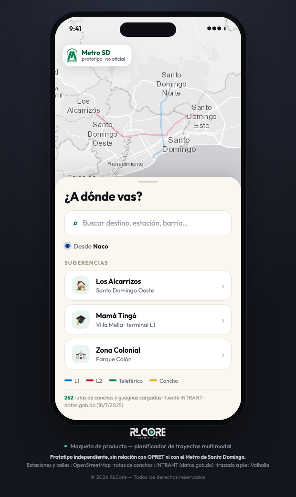
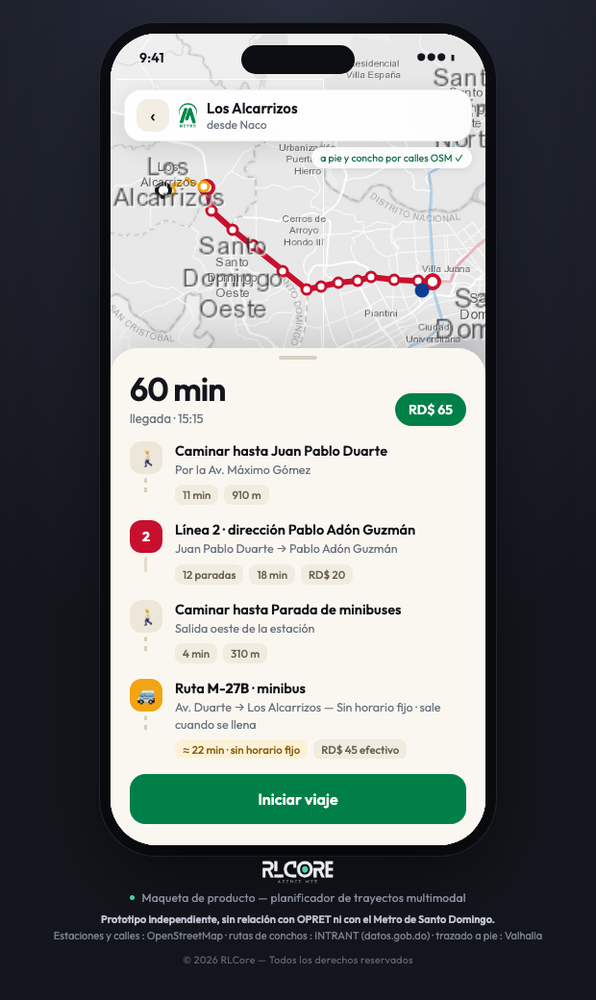
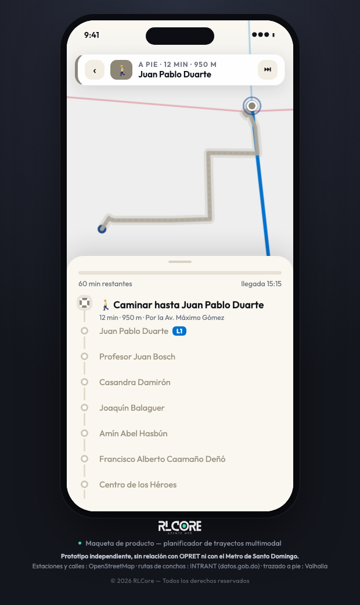

<div align="center">


# Metro SD

**A multimodal trip planner for Greater Santo Domingo — including the informal transit that no existing app covers.**

Interactive product mockup · [Live demo](https://metro-sd-ten.vercel.app)

</div>

---

## The problem

Santo Domingo has a metro, a cable car, and roughly 3.5 million people. It also has *conchos* and *guaguas* — shared taxis and minibuses that carry the majority of daily trips, with no fixed stops, no timetables, and no published routes. Just known corridors and word of mouth.

Existing apps cover the metro badly and the informal network not at all. I wanted to know how bad the data gap actually was, so I measured it rather than guessed.

| What I checked | What I found |
|---|---|
| OpenStreetMap bus routes across Greater Santo Domingo | **1** urban route mapped, out of ~275 that exist |
| OSM bus stops for a metro area of 3.5 M people | 174 |
| GTFS feeds for the Dominican Republic in the global Mobility Database | **1** — and it's Santiago, not the capital |
| INTRANT's official route dataset | 275 routes, full fare and operator data, **zero geometry** |

So the country knows how to publish transit data — Santiago de los Caballeros has a complete GTFS feed with 168 routes and 7,391 stops, built by its city council with OMSA and INTRANT. The capital simply has nothing equivalent.

That gap is the product thesis: **the hard part isn't routing, it's that the data doesn't exist.**

## What this mockup does

Three screens: pick a destination, see the route drawn on the map, then follow the journey live with the current stop highlighted and your position advancing along the path.

<div align="center">



</div>

The middle screen is the point of the whole project. A trip to Los Alcarrizos is *walk → Metro Line 2 → walk → concho M-27B → walk*, priced end to end at RD$65. The concho leg shows the real route code, the real fare, the operating union and the number of vehicles on the line — because that data exists officially and nobody has ever put it in front of a passenger.

## Where the data comes from

Nothing here is invented, and where something is approximate the interface says so.

- **39 metro stations** across Lines 1 and 2, with coordinates and ordering pulled from OpenStreetMap `route=subway` relations tagged `operator=OPRET`
- **189 urban concho and guagua routes** with fare, operating hours, union and fleet size, converted from INTRANT's official CSV published on [datos.gob.do](https://datos.gob.do)
- **Walking and concho legs routed along real streets** via Valhalla on OpenStreetMap data
- **Metro legs drawn as straight lines** between stations — it runs underground, so following the road network would be wrong
- Base map: Esri Light Gray Canvas

The one honest gap: the drawn concho path is the most plausible road route between two points. **The real geometry of those 262 routes does not exist in any public source** — which is precisely the hole this project exists to fill.

## Technical notes

Deliberately dependency-free. No build step, no framework, no package manager — open `prototype/index.html` and it runs. For a mockup whose job is to be shown to people on whatever device is in the room, that portability is a feature.

A few things worth pointing out:

**Route drawing** animates `stroke-dashoffset` on the SVG path Leaflet generates, so the line draws itself without a third-party animation library.

**Live position** interpolates along the routed polyline proportionally to distance, not to vertex count — otherwise the marker crawls through dense curves and teleports across straight segments.

**Map centering** projects the target point, offsets it by half the bottom sheet's height, and re-projects. Centering naïvely puts the current stop behind the sheet, where nobody can see it.

**Journey animation** carries a session token. Skipping ahead or leaving the screen mid-animation would otherwise leave two `requestAnimationFrame` loops fighting over the same marker.

```
prototype/          the mockup — open index.html, nothing to install
  index.html        three screens
  data.js           metro network + demo itineraries
  rutas.js          generated from the INTRANT CSV — do not edit by hand
  app.js            Leaflet map, routing, journey simulation
data/               source data (INTRANT CSV, OSM metro export)
tools/              build-rutas.mjs — regenerates rutas.js from the CSV
docs/               screenshots
```

Regenerate the route data after an INTRANT update:

```bash
node tools/build-rutas.mjs
```

Serve it locally:

```bash
python3 -m http.server 8000 --directory prototype
```

Handy for demos: `#route=alcarrizos` opens an itinerary directly, `#route=colonial&live` starts the journey.

## Status

This is a product mockup, not a shipping app. It exists to make a case: that a trip planner for Santo Domingo is worth building, that the informal network is the part that matters, and that the data problem is solvable — starting from official sources that are already public.

---

<div align="center">

**A product mockup by [RLCore](https://www.rlcore.fr)**

© 2026 RLCore. All rights reserved.

Independent project, unaffiliated with OPRET or the Metro de Santo Domingo.<br>
The Metro de Santo Domingo logo shown in the interface is the property of its owner and is used here solely to illustrate a design concept.

</div>
